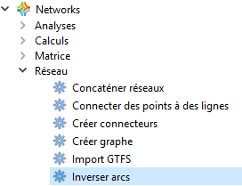
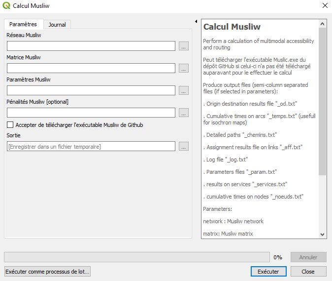
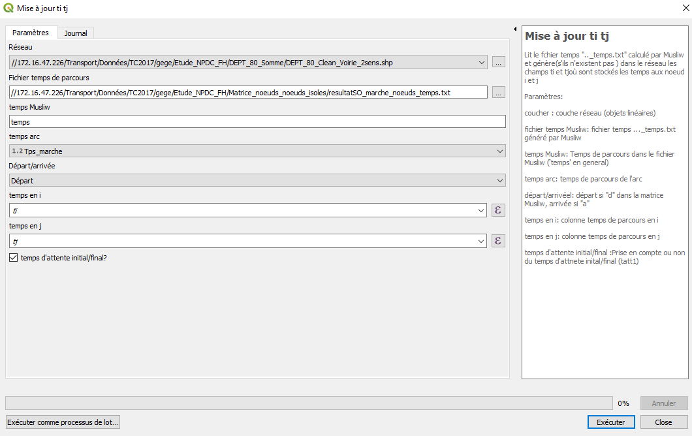
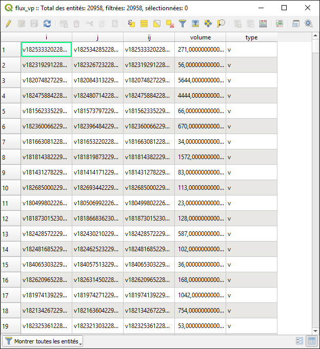
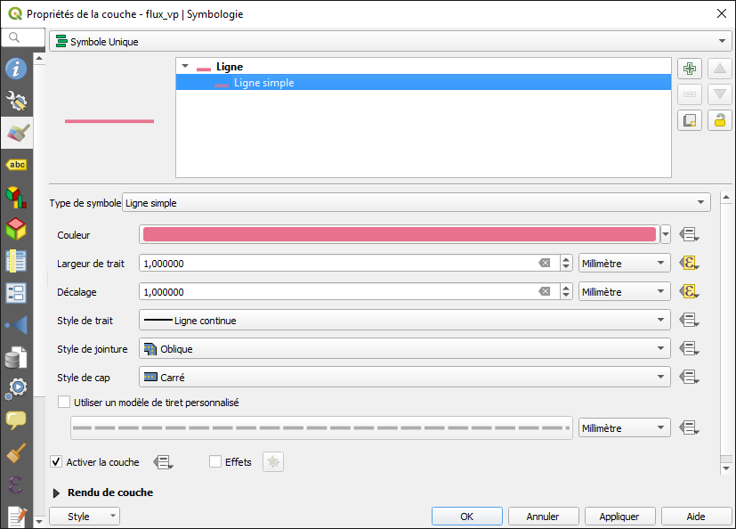
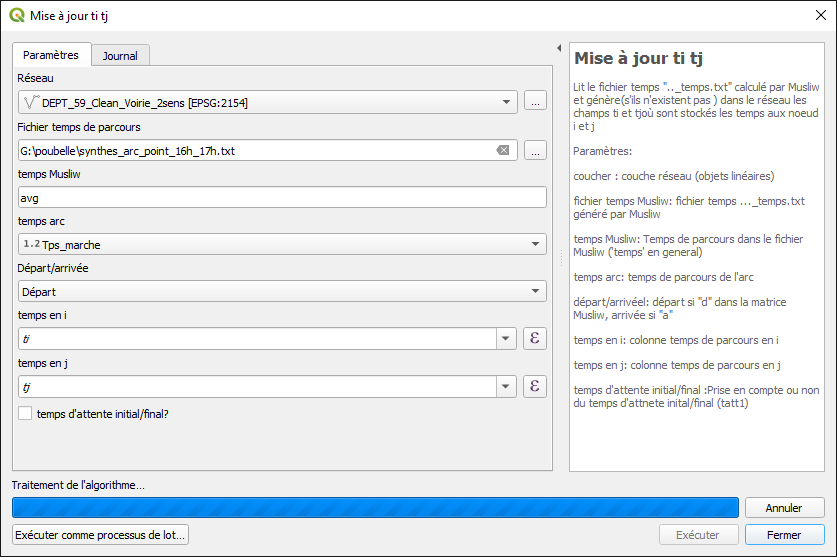

{width="3.8583333333333334in"
height="1.2215277777777778in"}

{width="8.26388888888889in"
height="1.6020833333333333in"}

**Formation bases de données**

**de l'offre régionale**

**de transports en commun**

  ------------------------------------------------------------------------------------- -------------------------------------------------------------------------------------
  {width="3.1493055555555554in" height="2.2243055555555555in"}   {width="3.1493055555555554in" height="2.2284722222222224in"}
  {width="3.1493055555555554in" height="2.0708333333333333in"}   {width="3.1493055555555554in" height="2.0902777777777777in"}
  ------------------------------------------------------------------------------------- -------------------------------------------------------------------------------------

**Sommaire**

[A-Réaliser une carte accessibilité (marche, vélo ou TC) à partir d'un
réseau multimodal 4](#__RefHeading___Toc3743_1033624957)

[AVERTISSEMENT 4](#__RefHeading___Toc4901_1999613306)

[Partie 1 : Préparation des données
5](#__RefHeading___Toc4903_1999613306)

[1.Récupérer un réseau Open street map (OSM)
5](#récupérer-un-réseau-open-street-map-osm)

[2.Nettoyer/Découper la table récupérée sous OSM
6](#nettoyerdécouper-la-table-récupérée-sous-osm)

[3.Ajouter et mettre à jour les colonnes dans la base voie découpée
7](#ajouter-et-mettre-à-jour-les-colonnes-dans-la-base-voie-découpée)

[4.Rendre les autoroutes intraversables
8](#rendre-les-autoroutes-intraversables)

[5.Préparation du sens 2 10](#préparation-du-sens-2)

[6.Générer les nœuds 11](#générer-les-nœuds)

[7.Créer le réseau (vélo ou marche) .txt
12](#créer-le-réseau-vélo-ou-marche-.txt)

[8.Supprimer les nœuds isolés (nœuds qui sont inaccessibles / non
connectés)
13](#supprimer-les-nœuds-isolés-nœuds-qui-sont-inaccessibles-non-connectés)

[9.Créer un réseau TC (générer réseau horaire pour carte accessibilité
TC) - A partir d'un fichier GTFS non prêt pour musliw
14](#créer-un-réseau-tc-générer-réseau-horaire-pour-carte-accessibilité-tc---a-partir-dun-fichier-gtfs-non-prêt-pour-musliw)

[10.Convertir réseau GTFS 15](#convertir-réseau-gtfs)

[11.Charger les arrêts (TC) dans Qgis
15](#charger-les-arrêts-tc-dans-qgis)

[12.Générer les connecteurs 16](#générer-les-connecteurs)

[13.Création du fichier multimodal 17](#création-du-fichier-multimodal)

[Partie 2 : Réalisation de la carte accessibilité
18](#__RefHeading___Toc5178_1999613306)

[14.Préparer la matrice pour musliw
18](#préparer-la-matrice-pour-musliw)

[15.Calcul paramètre 18](#calcul-paramètre)

[16.Calcul Musliw 19](#calcul-musliw)

[17.Mettre à jour les champs ti et tj
19](#mettre-à-jour-les-champs-ti-et-tj)

[18.Lancer l'interpolation linéaire 20](#lancer-linterpolation-linéaire)

[19.Créer isovaleurs (polygones) 20](#créer-isovaleurs-polygones)

[Partie 3 : Pour aller plus loin 22](#__RefHeading___Toc2762_794268476)

[20.Calcul population à l'intérieur des isochrones
22](#calcul-population-à-lintérieur-des-isochrones)

[B-Réaliser une carte d'offre TC (exemple : l'offre TER)
23](#__RefHeading___Toc3745_1033624957)

[1.Récupérer l'offre théorique sur le site Open Data SNCF
23](#récupérer-loffre-théorique-sur-le-site-open-data-sncf)

[2.Chargement du Plugin « Networks » 25](#chargement-du-plugin-networks)

[3.Pré-traitement du fichier GTFS 26](#pré-traitement-du-fichier-gtfs)

[4.Importer le GTFS dans Qgis 27](#importer-le-gtfs-dans-qgis)

[5.Visualiser les arrêts 28](#visualiser-les-arrêts)

[6.Afficher le nom des gares 29](#afficher-le-nom-des-gares)

[7.Carte de symboles proportionnels
31](#carte-de-symboles-proportionnels)

[8.Visualiser le nombre de circulations par arc
33](#visualiser-le-nombre-de-circulations-par-arc)

[9.Épaisseurs proportionnelles au nombre de circulations
34](#épaisseurs-proportionnelles-au-nombre-de-circulations)

[10.Indiquer le nombre de circulations
36](#indiquer-le-nombre-de-circulations)

[C-Réaliser une carte de trafic 39](#__RefHeading___Toc502_1873892231)

[1.Récupérer les résultats des trafics
40](#récupérer-les-résultats-des-trafics)

[2.Paramétrer les épaisseurs proportionnelles
41](#paramétrer-les-épaisseurs-proportionnelles)

[3.Régler la largeur du trait avec une expression
42](#régler-la-largeur-du-trait-avec-une-expression)

[4.Afficher les chiffres des flux 44](#afficher-les-chiffres-des-flux)

[D-Réaliser une carte d'accessibilité sur une période horaire et/ou à
partir/vers plusieurs points 48](#__RefHeading___Toc602_966329769)

[1.Paramétrer le calcul d'accessibilité
50](#paramétrer-le-calcul-daccessibilité)

A.  []{#__RefHeading___Toc3743_1033624957 .anchor}Réaliser une carte
    accessibilité (marche, vélo ou TC) à partir d'un réseau multimodal

    []{#__RefHeading___Toc4901_1999613306 .anchor}AVERTISSEMENT

**Ne pas mettre de blanc ni d'accent pour les noms de répertoire et/ou
de tables. Exemple : Armentieres/voirie_decoupe_2sens**

{width="2.045138888888889in"
height="7.4631944444444445in"}

La plupart des scripts utilisés pour :

\- modifier les différentes couches voiries, nœuds, \...

\- créer les différents réseaux (vélo, marche, transport)

se trouvent dans la boîte à outils de traitements, sous l'onglet
**Networks**.

[]{#__RefHeading___Toc4903_1999613306 .anchor}Partie 1 : Préparation des
données

Récupérer un réseau Open street map (OSM)
=========================================

Onglet : **Extension** / Installer gérer les extensions : **Installer
Quick OSM**

{width="6.263194444444444in"
height="0.8083333333333333in"}

{width="3.6534722222222222in"
height="2.2493055555555554in"}

**Saisir la requête suivante :**

**Exemple pour obtenir les voies du département 90.**

{width="4.669444444444444in"
height="3.972916666666667in"}\[timeout:2500\]

\[maxsize:2000000000\];

area\[admin_level=\'6\'\]\[ref=\'90\'\]-\>.area;

rel(pivot.area)-\>.rel;

(

node\[highway\](area.area);

node\[highway\](r.rel);

way\[highway\](area.area);

way\[highway\](r.rel);

rel\[highway\](area.area);

rel\[highway\](r.rel);

);

(.\_;\>;);

out;

**Ensuite :**

Générer la requête

Exécuter

Fermer

Enregistrer la table « Osmquery » : **modifier le SCR (EPSG 2154)**

Exemple : DEPT90_voirie

**Enregistrer la requête pour charger d'autres réseaux.**

Nettoyer/Découper la table récupérée sous OSM
=============================================

**[Afficher la boîte à outils de traitement (si pas affichée)]{.ul}**

**Onglet : Traitement / Boîte à outils**

{width="7.480555555555555in"
height="1.4243055555555555in"}

**[Afficher la Commande Grass / Vecteur (v.\*) / v.clean]{.ul}**

{width="4.2340277777777775in"
height="1.5729166666666667in"}

[Commande Grass / Vecteur (v.\*) / v.clean]{.ul} :

Layer to clean : sélectionner la couche à nettoyer : **DEPT01_Voirie**

Cleaning tools : indiquer les outils : **break,bpol**

Threshold (comma separated for each tool) : Indiquer le séparateur :
**0,0**

Cleaned : enregistrer le résultat dans un fichier :
**Clean_DEPT01_Voirie**

Errors : enregistrer un fichier erreur : **Error_clean_DEPT01_Voirie**

Exécuter

{width="5.722222222222222in"
height="3.609027777777778in"}

{width="2.0368055555555555in" height="2.1in"}

**Enregistrer la table cleaned** (base voie découpée) ajoutée dans
Qgis : **modifier le SCR (EPSG 2154)**

Exemple : Clean_DEPT01_voirie

**Ajouter et mettre à jour les colonnes dans la base voie découpée**
====================================================================

***[SCRIPT]{.ul} **: **Mise à jour champ***

***Clic droit sur script Mise à jour champ et sélectionner « Exécuter
comme processus de lot » (penser à sauvegarder la requête pour
l'utiliser à nouveau)***

{width="3.7604166666666665in"
height="1.7006944444444445in"}

{width="7.063194444444444in"
height="1.4229166666666666in"}

***Sélectionner la base voie à modifier :***

***Les colonnes à créer et à mettre à jour :***

Champ : **Sens**

Type : **String**

Taille : **1**

Précision : **0**

Filtre :

Formule : **'1'**

Champ : **Longueur**

Type : **Double**:

Taille : **15**

Précision : **5**

Filtre :

Formule  : **\$length**

Champ : **Diffusion**

Type : **String**

Taille : **1**

Précision : **0**

Filtre :

Formule : **'3'** (autorise la diffusion dans les deux sens)

Champ : **Impasse**

Type : **String**

Taille: **1**

Précision : **0**

Filtre :

Formule : **'0'** (franchissable)

Champ : **Tps_vélo ou Tps_marche**

Type : **Double**

Taille : **15**

Précision : **5**

Filtre :

Formule : **\$length\*60/16000** (vélo : 16 km/h) ou
**\$length\*60/4000** (marche : 4 km/h)

***Résultat :***

{width="7.480555555555555in"
height="1.6930555555555555in"}

**Correspondances pour la colonne Type :**

String = chaîne de texte

Double = décimal

DateTime = Date/Heure

La colonne «** filtre **» est à utiliser pour la mise à jour d'un champ
existant.

Rendre les autoroutes intraversables
====================================

***[SCRIPT]{.ul} **: **Mise à jour Champ***

***Clic droit sur script Mise à jour Champ et sélectionner Exécuter
comme processus de lot (penser à sauvegarder la requête pour l'utiliser
à nouveau)***

{width="3.095833333333333in"
height="1.7833333333333334in"}

{width="7.480555555555555in"
height="1.6895833333333334in"}

***Les colonnes à mettre à jour :***

Champ : **Sens**

Type : **laisser le champ affiché par défaut**

Taille **: laisser le champ affiché par défaut**

Précision : **laisser le champ affiché par défaut**

Filtre : **highway in
(\'motorway\',\'motorway_link\',\'trunk\',\'trunk_link\')**

Formule : '0'

Champ : **Diffusion**

Type : **laisser le champ affiché par défaut**

Taille **: laisser le champ affiché par défaut**

Précision : **laisser le champ affiché par défaut**

Filtre : **highway in
(\'motorway\',\'motorway_link\',\'trunk\',\'trunk_link\')**

Formule : '0'

Champ : **Impasse**

Type : **laisser le champ affiché par défaut**

Taille **: laisser le champ affiché par défaut**

Précision : **laisser le champ affiché par défaut**

Filtre : **highway in
(\'motorway\',\'motorway_link\',\'trunk\',\'trunk_link\') and \"layer\"
is Null**

Formule : '3' (autoriser des 2 côtés sauf autoroute)

Champ : **Impasse**

Type : **laisser le champ affiché par défaut**

Taille **: laisser le champ affiché par défaut**

Précision : **laisser le champ affiché par défaut**

Filtre : **highway in
(\'motorway\',\'motorway_link\',\'trunk\',\'trunk_link\') and \"layer\"
in (\'0\')**

Formule : '3'

Champ : **Sens**

Type : **laisser le champ affiché par défaut**

Taille **: laisser le champ affiché par défaut**

Précision : **laisser le champ affiché par défaut**

Filtre : **foot in (\'no\')**

Formule : '0'

Champ : **Diffusion**

Type : **laisser le champ affiché par défaut**

Taille **: laisser le champ affiché par défaut**

Précision : **laisser le champ affiché par défaut**

Filtre : **foot in (\'no\')**

Formule : '0'

Champ : **Impasse**

Type : **laisser le champ affiché par défaut**

Taille **: laisser le champ affiché par défaut**

Précision : **laisser le champ affiché par défaut**

Filtre : **foot in (\'no\')**

Formule : '3'

***Résultat ***:

{width="7.1402777777777775in"
height="1.7638888888888888in"}

Préparation du sens 2
=====================

{width="2.4743055555555555in"
height="1.4770833333333333in"}***[SCRIPT]{.ul} **: **Inverser arcs***

*Réseau : **Ouvrir la couche réseau à inverser ***

*Ajouter au réseau **(si cocher : le sens 2 s'ajoute directement à la
couche réseau)***

*Enregistrer le résultat*

*Ouvrir ou pas la couche dans Qgis.*

*Résultat :*

{width="6.947916666666667in"
height="1.9388888888888889in"}

Uniquement pour réseau vélo « **à adapter selon le territoire »**

{width="0.25in" height="0.25in"} oneway= 'yes'
and highway in ('primary','secondary','tertiary','primary
link','secondary link','tertiary link') and cycleway is Null

Mettre à jour champ Sens : **'0'**

{width="0.3125in" height="0.3020833333333333in"}

A partir du boulier :

Mise à jour de la colonne « incline » pour inversion des inclinaisons
*(champs à adapter selon les types d'inclinaison dans la couche)*

Case when « incline »= 'up' then 'down'

when « incline »= 'down' then 'up'

when « incline »= '-8%' then '8%'

when « incline »= '10%' then '-10%'

when « incline »= '8%' then '-8%'

when « incline »= '-10%' then '10%'

else Null

End

Générer les nœuds
=================

{width="3.5in" height="1.75in"}**SCRIPT**
***Créer graphe***

Réseau : **Charger la couche réseau**

Node id : **Chaîne géographique (unique)**

Préfixe : **m** (pour différencier les nœuds des différents modes de
transport)

Table des nœuds : **Donner un nom à la couche des nœuds**

Exécuter

***Résultat :***

{width="7.480555555555555in"
height="4.759722222222222in"}

Uniquement pour réseau vélo « **à adapter selon le territoire »**

Mise à jour du champ temps vélo à partir du boulier *(champs à adapter
selon les types d'inclinaison dans la couche)*

case when « incline » = 'up' then \$length\*60/8000

when « incline » = 'down' then \$length\*60/24000

when « incline » = '-8 %' then \$length\*60/32000

when « incline » = '10 %' then \$length\*60/4000

when « incline » = '8 %' then \$length\*60/4000

when « incline » = '-10 %' then \$length\*60/32000

else NULL

END

Créer le réseau (vélo ou marche) .txt
=====================================

{width="3.140972222222222in"
height="2.161111111111111in"}

**SCRIPT** ***Réseau Musliw transport individuel***

Permet de générer un réseau transport individuel au format Musliw à
partir d\'une couche Qgis

Ouvrir la couche réseau

Lancer script ti

Réseau routier : **nom de la couche voirie**

Sens : **Sens**

Temps : **Tps_marche**

Longueur : **Longueur**

i-node : **i**

j-node : **j**

Id période : **ne rien modifier**

Id plage horaire : **ne rien modifier**

Heure début : **ne rien modifier**

Heure fin : **ne rien modifier**

Calendrier : **ne rien modifier**

Texte arc : **highway**

Mode : **m** (si marche)

Réseau musliw : **Enregistrer réseau** **(avec extension .txt)**

**Exécuter**

**Résultats**

{width="5.110416666666667in"
height="5.122916666666667in"}

**Supprimer les nœuds isolés** (nœuds qui sont inaccessibles / non connectés)
=============================================================================

{width="2.285416666666667in"
height="2.154166666666667in"}

**SCRIPT Nœuds isolés**

**Nœuds** : **ouvrir la couche nœud**

Id nœud : **num**

Réseau Musliw : **ouvrir réseau marche .txt**

Id réseau : 0 dans un premier temps, ensuite 1 voire 2, etc. selon le
résultat de l'analyse des graphes

Nœuds connectés : **enregistrer le fichier**

{width="5.627777777777778in"
height="3.129861111111111in"}

**Dans cet exemple, il y a pour le réseau 0, 130 950 nœuds connectés.**

{width="4.695138888888889in"
height="3.7083333333333335in"}

Créer un réseau TC (générer réseau horaire pour carte accessibilité TC) - **A partir d'un fichier GTFS non prêt pour musliw**
=============================================================================================================================

{width="1.8020833333333333in"
height="1.6965277777777779in"}

**SCRIPT Préparer GTFS**

Clic droit sur le script / **Exécuter par lot**

Sélectionner le **répertoire source** (endroit où sont stockés les GTFS)

Id réseau : **AE** (exemple AE pour Aéroport Lille)

Extraire stop_id ? (UIC) : **Non**

Formule d'extraction : **laisser la valeur par défaut parce que** UIC =
non

Répertoire GTFS destination : Enregistrer le résultat dans le
**répertoire résultat**. Exemple répertoire «** GTFS **»

**Exécuter**

***Résultat :***

{width="7.480555555555555in"
height="2.2819444444444446in"}

**Dans le répertoire résultat** (sauvegarde des fichiers GTFS créés),
éditer le fichier (avec par exemple Notepad) **calendar.txt de chaque
réseau** afin de sélectionner une semaine type (hors périodes de
vacances). Exemple : du 10/06/2019 au 16/06/2019

{width="7.480555555555555in"
height="2.0097222222222224in"}

{width="1.9215277777777777in" height="2.0729166666666665in"}Convertir réseau GTFS
=========================================================================================================

**SCRIPT Réseau Musliw à horaires**

Répertoire GTFS : ouvrir le répertoire où se trouvent les fichiers GTFS

Début calendrier : **Indiquer date de début de semaine (démarre le
lundi)**

Fin calendrier (semaine type) **Indiquer date de fin de semaine (termine
le dimanche)**

Réseau musliw à horaires : Enregistrer le nom du réseau **(avec
extension .txt) -- Exemple AE.txt**

**Exécuter**

{width="7.044444444444444in" height="2.06875in"}

Charger les arrêts (TC) dans Qgis
=================================

**SCRIPT Import GTFS**

Clic droit / Exécuter par lot (penser à sauvegarder la requête)

Répertoire GTFS : **Sélectionner le répertoire GTFS**

Début calendrier : **10/06/2019**

Fin calendrier : **16/06/2019** (si semaine choisie lundi 10 juin 2019
au dimanche 16 juin 2019)

Heure début : **laisser les valeurs par défaut**

Heure fin : **laisser les valeurs par défaut**

Nom des tables : **AE** (remettre le nom du réseau exemple AE pour
aéroport de Lille

CRS : **laisser les valeurs par défaut (EPSG 2154)**

Encodage : **« utf8 » laisser cette valeur par défaut. Si jamais ne
fonctionne pas avec cette variable, remplacer « utf8 » par « cp1252 »**

Répertoire destination : **créer un répertoire de sauvegarde** (exemple
shp (les fichiers de sorties sont des .shp))

**Exécuter**

***Résultat :***

{width="7.335416666666666in"
height="1.323611111111111in"}

Générer les connecteurs
=======================

Afficher les nœuds précédemment générés

Afficher le réseau voirie

**SCRIPT Créer connecteurs**

Permet à partir de deux couches (arrêts de transport en commun et nœuds
d\'un réseau routier) de générer un fichier Musliw de connecteurs. **Le
connecteur créé est visible**.

[Connecter les arrêts aux nœuds piéton les plus proches]{.ul}

Clic droit / Exécuter par lots

arrêt : **arrêt TC (stops.shp)**

stop id : **ident**

texte nœud i : **t** (TC)

mode nœud i : **t** (TC)

nœud : **table nœud piéton**

node id : **num**

texte nœud j : **m** (marche)

mode nœud j : **m** (marche)

rayon recherche : **1000**

vitesse : **0**

Nombre max : **1**

Enregistrer le fichier : connecteur_reseau_tc_map

{width="7.480555555555555in" height="1.75625in"}

**(suite du script)**

{width="7.480555555555555in"
height="1.6791666666666667in"}

Création du fichier multimodal
==============================

**SCRIPT Concaténer réseaux**

[Concaténer les différents réseaux dont l'extension est .txt]{.ul}

Réseau marche

Connecteurs

Arrêts piétons

Horaires TC

\...

Mettre l'ensemble des fichiers à concaténer dans un répertoire
**(exemple : répertoire « concatener »**

source : **sélectionner le répertoire où se trouvent les fichiers .txt à
concaténer**

réseau multimodal : **enregistrer réseau multimodal** (**avec extension
.txt**)

Exécuter

***Résultat :***

{width="7.480555555555555in" height="1.98125in"}

[]{#__RefHeading___Toc5178_1999613306 .anchor}Partie 2 : Réalisation de
la carte accessibilité

{width="3.4444444444444446in" height="3.734722222222222in"}Préparer la matrice pour musliw
==================================================================================================================

SCRIPT **Matrice Musliw simple**

Nœuds : **fichier nœuds**

Id nœud : **num**

Point de départ : **sélectionner directement dans Qgis le nœud de
départ**

Point d'arrivée : **sélectionner directement dans Qgis le nœud
d'arrivée**

Demande : **nombre de passagers**

Jour : **1**

Horaire : **horaire format 00:00:00**

Départ/Arrivée : **à choisir**

Mode écriture : **écriture ou Ajout (lot)**

Fichier matrice : **enregistrer la matrice**

Calcul paramètre
================

{width="2.3333333333333335in"
height="1.0208333333333333in"}

{width="4.7131944444444445in"
height="4.29375in"}

**SCRIPT Paramètre Musliw**

Facteur d'échelle temps individuel : **0,25 pour le vélo**

Temps détaillé : **Sans les arcs à horaires** (fichier temps)

{width="1.6770833333333333in" height="0.1625in"}

Calcul Musliw
=============

{width="3.435416666666667in"
height="3.736111111111111in"}

Réseau Musliw : **Réseau marche txt**

Matrice Musliw : **Matrice**

Paramètre Musliw : **fichier parmètre**

Pénalités Musliw (optional) : **fichier pénalités (si pénalités)**

Accepter de télécharger l'exécutable Musliw : **Cocher la case si Musliw
n'a pas encore été téléchargé.**

Mettre à jour les champs ti et tj
=================================

{width="4.510416666666667in"
height="2.89375in"}**SCRIPT Mise à jour ti tj**

Réseau: **reseau_voirie.shp**

Fichier temps de parcours : **sélectionner le fichier temps générer par
musliw**

Temps musliw : **temps**

Temps arc : **Tps_marche**

Départ/arrivée : **celui de la matrice musliw**

Temps en i : **ti si ce champ existe (mise à jour) ou possibilité de
créer un nouveau champ, dans ce cas écrire « ti_velo » par exemple.**

Temps en j : **tj (idem Temps en i)**

Cocher d'attente initial/final pour ne pas prendre en compte le temps
restant depuis l'arrêt si par exemple arrivée à 8h20 alors que dans la
matrice l'arrivée est prévue à 8h30. Dans ce cas il ne prend pas en
compte les 10 min restantes.

Lancer l'interpolation linéaire
===============================

**SCRIPT Interpolation linéaire**

{width="2.667361111111111in"
height="1.2645833333333334in"}

Réseau : **réseau_voirie_shp**

Fenêtre **: permet de zoomer sur la couche**

Temps i : **i**

Temps j : **j**

Sens : **Sens**

Diffusion : **Diffusion**

Impasse : **Impasse**

Nb pixel x :**200**

Nb pixel y : **200**

Taille pixel x : **laisser les valeurs par défaut**

Taille pixel y : **laisser les valeurs par défaut**

Décimales : **5**

Rayon(m) : **1000**

Vitesse diffusion : **4** (4 km/h map) vitesse à adapter selon le mode
(16 km/h vélo)

ou pour une carte affichage en distance : **60**

Intraversables : **ne pas cocher**

Fichier Raster : enregistrer le raster

**Exécuter**

Créer isovaleurs (polygones)
============================

**SCRIPT Contour iso-valeurs**

{width="4.638194444444444in"
height="2.8944444444444444in"}

Raster : **ouvrir le raster**

Bande :

Min : **0**

Max : **60** selon durée choisie

Intervalle : **10** selon le seuil choisi

Valeur absente : **laisser la valeur par défaut**

Polygones : **cocher la case**

Contours iso-valeurs : **enregistrer l'isochrone**

Ouvrir le fichier en sortie après l'exécution de l'algorithme : **cocher
la case**

**Exécuter**

**Exemple isochrone**

{width="3.525in" height="3.3159722222222223in"}

[]{#__RefHeading___Toc2762_794268476 .anchor}Partie 3 : Pour aller plus
loin

Calcul population à l'intérieur des isochrones
==============================================

{width="2.46875in" height="1.21875in"}**SCRIPT
Agrégation spatiale**

Ouvrir la couche isochrone

Ouvrir la couche des communes avec les données « population »

{width="3.0069444444444446in"
height="3.1631944444444446in"}Polygones : **afficher l'isochrone**

Id : **identifiant du polygone** (correspond au seuil défini dans le
polygone)

Source : **table des communes**

Variable : **nom du champ où se trouvent les données « population »**

Agrégateur : **somme** (pour sommer). Choix entre moyenne, min, max

Sortie : **enregistrer le résultat**

**Résultats**

{width="3.54375in" height="1.792361111111111in"}

B.  []{#__RefHeading___Toc3745_1033624957 .anchor}Réaliser une carte
    d'offre TC (e**xemple : l'offre TER)**

Récupérer l'offre théorique sur le site Open Data SNCF
======================================================

([[https://data.sncf.com/explore/?sort=modified]{.ul}](https://data.sncf.com/explore/?sort=modified)
)

{width="6.6930555555555555in"
height="5.527083333333334in"}

**Choisir l'offre que l'on souhaite représenter** (Ici dans l'exemple
les horaires des lignes TER).

Cliquer sur **« export-ter-gtfs-line.zip »** pour l'enregistrer

{width="6.6930555555555555in"
height="5.527083333333334in"}

**Accepter les conditions**

{width="4.520833333333333in"
height="3.3333333333333335in"}

**Enregistrer puis décompresser l'archive dans un répertoire.**

Chargement du Plugin « Networks »
=================================

Dans Qgis **télécharger et activer le plugin « Networks »** qui vous
ajoute un fournisseur d'algorithmes dans la le boîte à outils de
traitements.

{width="6.6930555555555555in"
height="5.175694444444445in"}

Pré-traitement du fichier GTFS
==============================

Choisir tout d'abord **l'algorithme** **« préparer GTFS »** pour
effectuer un pré-traitement sur les fichiers GTFS bruts afin qu'ils
soient exploitables avec les autres outils du fournisseur d'algorithmes
Networks et puissent être utilisés avec Musliw.

{width="6.6930555555555555in"
height="3.785416666666667in"}

**L'algorithme génère des fichiers GTFS prêts à être utilisés.**

{width="6.6930555555555555in"
height="3.191666666666667in"}

Importer le GTFS dans Qgis
==========================

Ouvrir Qgis et exécuter **l'algorithme** **« import GTFS »** pour
pouvoir visualiser l'offre dans le logiciel.

{width="4.308333333333334in"
height="3.8465277777777778in"}

Les dates de début et fin de calendrier doivent être des dates pour
lesquelles les données sont présentes dans le GTFS.

Pour cela vous pouvez regarder dans les fichiers **calendar.tx**t et/ou
**calendar_dates.txt** pour choisir une semaine ou une période pour
laquelle les horaires sont décrits.

{width="6.6930555555555555in"
height="3.785416666666667in"}

Visualiser les arrêts
=====================

Ouvrir la couche **« \_stops.shp »** qui contient la table des points
d'arrêt

{width="6.6930555555555555in"
height="3.920138888888889in"}

**Résultats**

{width="5.96875in" height="4.545833333333333in"}

Afficher le nom des gares
=========================

Pour afficher les noms des gares, il faut afficher les étiquettes avec
la colonne **nom.**

Par contre, nous constatons que le nom de gare est affiché avec **« Gare
de »** devant le nom de la gare.

{width="6.6930555555555555in"
height="5.175694444444445in"}

**Pour ne pas afficher** **« Gare de »**, il est possible d'utiliser
**une expression régulière** qui va remplacer « Gare de » par une chaîne
vide.

{width="6.6930555555555555in"
height="3.4159722222222224in"}

**Résultat**

{width="6.6930555555555555in"
height="5.175694444444445in"}

Carte de symboles proportionnels 
================================

Pour effectuer une **carte par symboles proportionnels**, il faut
personnaliser **l'attribut taille** par une expression comprenant le nom
du champ à représenter.

{width="6.6930555555555555in"
height="5.163194444444445in"}

L'élément **\@value** représente la valeur de l'attribut épaisseur. Le
conserver dans l'expression permet de régler la taille directement en
modifiant la valeur numérique inscrite dans l'attribut de taille, sans
devoir modifier l'expression.

{width="5.911111111111111in"
height="3.0659722222222223in"}

**Résultat**

{width="6.6930555555555555in"
height="5.175694444444445in"}

Visualiser le nombre de circulations par arc
============================================

Pour visualiser **le nombre de circulations par arc**, il faut charger
**la couche des « \_lines ».**

Par contre, le tracé des lignes est simplifié, car il est constitué
d'une ligne droite entre deux arrêts ou gares successifs.

**Charger la couche « lines »**

{width="5.434722222222222in"
height="3.1902777777777778in"}

**Résultat**

{width="6.225694444444445in"
height="4.972916666666666in"}

Épaisseurs proportionnelles au nombre de circulations
=====================================================

**Attention **: Si un réseau contient des troncs communs où plusieurs
lignes passent au même endroit (les mêmes deux arrêts successifs), alors
les paramétrages ci-dessous ne sont plus adaptés et nécessitent des
expressions un peu plus complexes non présentées dans ce document qui
permettent de visualiser les lignes du tronc commun les unes à côté des
autres et de ne pas les superposer.

**Indiquer une épaisseur de trait et un décalage personnalisé**

{width="5.595833333333333in"
height="4.242361111111111in"}

**Epaisseur « largeur de trait »**

{width="6.219444444444444in"
height="2.9444444444444446in"}

**Décalage**

{width="6.6930555555555555in"
height="3.4159722222222224in"}

NB : Les valeurs numériques inscrites dans **«largeur de trait»** et
dans **« décalage »** **doivent être identiques** avec les expressions
indiquées ici.

Indiquer le nombre de circulations
==================================

Choisir **nb_mon-fri** (nombre moyen de circulations la semaine du lundi
au vendredi). Comme il s'agit d'une moyenne, bien spécifier nombres
formatés avec **« 0 »** en places des décimales.

PS : En général, plutôt que des étiquettes simples, choisissez
**« étiquettes basées sur des règles »**

Cela vous permettra de filtrer les étiquettes plus facilement, car si
vous avez paramétré de manière complexe vos étiquettes simples, le
changement de type d'étiquettes vous fera perdre ce paramétrage qu'il
faudra renouveler avec les étiquettes basées sur des règles.

{width="6.6930555555555555in"
height="5.527083333333334in"}

Indiquer la **même distance que la valeur d'épaisseur et de décalage**
des lignes et cocher **« orientation de la ligne suivant la position »**
et **« à droite de la ligne »** pour un rendu de type carte de trafic.

{width="6.6930555555555555in"
height="5.527083333333334in"}

**Expression de la distance :**

{width="6.6930555555555555in"
height="3.4159722222222224in"}

Comme pour les circulations ferroviaires les successions de gares ne
sont pas toutes identiques selon les services, la carte n'est pas
forcément très lisible.

Il existe une méthode pour pallier à cet inconvénient qui nécessite une
couche du tracé réel des lignes parcourues par les services. Elle est
plus longue et complexe puisqu'elle nécessite la création d'un réseau et
un calcul du plus court chemin entre la liste des OD constituées de
l'ensemble des deux gares successives et n'est pas décrite dans ce
document.

{width="6.6930555555555555in"
height="5.175694444444445in"}

C.  []{#__RefHeading___Toc502_1873892231 .anchor}Réaliser une carte de
    trafic

L'objectif de ce tutoriel est de réaliser une carte de trafic.

Dans un premier temps une matrice Musliw a été créée à partir du fichier
de l'enquête déplacements des grands mobiles picards résidant dans le
Département de l'Oise en ne conservant que les déplacements effectués en
voiture en tant que conducteur.

L'objectif est de visualiser les lignes de désir des automobilistes
isariens.

Le calcul des itinéraires est effectué avec Musliw grâce au **script**
« Calcul Musliw »

{width="7.428472222222222in"
height="4.686111111111111in"}

**Le fichier « \_aff »** contient la liste des arcs du réseau utilisé
(ici route 500) avec le volume d'automobilistes souhaitant l'emprunter
pour effectuer leurs déplacements

Récupérer les résultats des trafics
===================================

Le réseau routier utilisé ici étant le réseau Route500, c'est lui qui
doit servir de référence pour récupérer les résultats de calcul de
Musliw

La colonne qui correspond au trafic s'appelle en général **volau**
(Volumes automobiles), et il faut récupérer le **fichier « \_aff »** du
calcul qui contient les informations du nombre de voitures par arc
Musliw et donc pour le cas présent : arc Route500.

{width="5.010416666666667in"
height="3.5145833333333334in"}

Le **script** génère une **table flux_vp.shp** qui contient les arcs
route500 ayant été empruntés par au moins une OD de la matrice.

{width="5.274305555555555in"
height="4.080555555555556in"}

**Données table flux_vp**

{width="4.277083333333334in" height="4.675in"}

Paramétrer les épaisseurs proportionnelles
==========================================

Aller dans les propriétés de style de la couche pour **définir le style
de ligne**. Les valeurs numériques **« Largeur du trait »** et
**« Décalage »** doivent être identiques

{width="5.499305555555556in"
height="3.865972222222222in"}

Régler la largeur du trait avec une expression
==============================================

**Largeur de trait**

{width="6.133333333333334in"
height="3.6631944444444446in"}

Puis le **décalage** puisqu'il s'agit de trafics orientés. La **valeur
de +0.2** sert à laisser un petit espace permettant de bien différencier
visuellement les deux sens de circulation.

{width="6.029166666666667in"
height="3.6006944444444446in"}

**\@value** correspond à la valeur numérique inscrite dans les
paramètres d'épaisseur et de décalage. C'est important de l'introduire
dans l'expression car cela permet ensuite de régler l'épaisseur du
trafic en jouant sur le curseur sans à avoir à modifier la formule.

**Résultats**

{width="6.6930555555555555in"
height="5.138888888888889in"}

Afficher les chiffres des flux
==============================

Créer des **étiquettes basées sur des règles**, car il faudra filtrer
les petits flux ensuite. Il est important cliquer sur le bouton
{width="0.34375in"
height="0.2604166666666667in"} afin d'ajouter une règle même si dans un
premier temps il n'y a pas de filtre.

{width="4.6375in" height="4.910416666666666in"}

**Possibilité de mettre en forme le texte**

{width="5.945833333333334in"
height="3.5097222222222224in"}

**Possibilité de définir la position de l'étiquette**

{width="5.925in" height="3.41875in"}

**Résultat**

{width="7.138888888888889in"
height="5.238888888888889in"}

La carte contient trop d'étiquettes et devient illisible. De plus, la
précision à l'unité est illusoire compte tenu du taux de sondage de
l'enquête.

Nous allons **filtrer les étiquettes** pour les flux \<2000, **fusionner
les étiquettes** pour des arcs adjacents ayant la même valeur et
**arrondir les flux** à la centaine la plus proche.

{width="5.83125in" height="6.177777777777778in"}

Indiquer la **même distance que la valeur d'épaisseur et de décalage**
des lignes et cocher **« orientation de la ligne suivant la position »**
et **« à droite de la ligne »** pour un rendu de type carte de trafic.

**Résultat**

{width="6.6930555555555555in"
height="5.138888888888889in"}

D.  []{#__RefHeading___Toc602_966329769 .anchor}Réaliser une carte
    d'accessibilité sur une période horaire et/ou à partir/vers
    plusieurs points

Exemple avec un point sur une période (plusieurs heures d'arrivée ou de
départ)

**Sélectionner un point** (en jaune sur la carte)

{width="3.925in" height="4.534027777777778in"}

Sélection le **SCRIPT** **Matrice Musliw simple liste**

Noeuds : **sélectionner la couche des nœud**s sur laquelle le nœud est
sélectionné.

Cocher la case **Entité(s) sélectionné(e) uniquement**

Renseigner les champs **Heure de débu**t et **Heure de fin** de la
période : exemple 16:00:00 -- 17:00:00

Renseigner **l'intervalle de temps en minutes** : exemple 15,0000

Cocher la case **Matrice diagonale** (même origine, même destination).

Enregistrer la matrice.

{width="6.6930555555555555in"
height="5.413194444444445in"}

**D'où la matrice générée.**

{width="5.239583333333333in"
height="1.8541666666666667in"}

Paramétrer le calcul d'accessibilité
====================================

Dans le champ temps détaillé, afficher **« sans les arcs à horaires »**

{width="6.6930555555555555in" height="7.4125in"}

**SCRIPT Calcul Musliw**

{width="6.6930555555555555in"
height="3.670138888888889in"}

A partir des fichiers résultats du calcul Musliw, on va utiliser le
**fichier temps**.

Dans ce fichier temps, il y a plusieurs temps par arc parce qu'il y a 1
simulation par horaire sur la période. Ici 4 temps par arc, ce qui
correspond à 1 par 1/4 d'heure (cf. matrice générée).

On ne peut donc pas représenter directement les isochrones, il est
nécessaire de faire une analyse statistique (temps, mini, moyen,
maxi\...).

Pour ce faire, **SCRIPT indicateurs par tronçon**

Fichier temps Musliw : **fichier temps** (résultat du calcul)

Variable : choisir la variable **temps**

{width="6.258333333333334in"
height="3.332638888888889in"}

La suite se déroule comme pour la réalisation d'une carte
d'accessibilité classique, sauf que pour la mise à jour ti tj, il faut
choisir quel temps on souhaite représenter **dans la variable « temps
Musliw »** (le temps mini : min, le temps moyen : avg, le temps maxi :
max).

{width="6.6930555555555555in"
height="4.4534722222222225in"}

Pour réaliser la carte, reprendre à partir de A- Réaliser une carte
accessibilité, partie 2 (réalisation de la carte accessibilité), niveau
5 (lancer l'interpolation linéaire).
